<h1 align="center">
  U.S. Banks Data Engineering Pipeline
</h1>

<p align="center">
  End-to-end data pipeline for extracting, validating, integrating, transforming, and serving U.S. listed bank data from Yahoo Finance using Docker, Airflow, Airbyte, PostgreSQL, ClickHouse, and dbt.
</p>

<div align="center">
  
  
  
  
  
  
  
</div>

---

This repository contains the technical solution for a data engineering assessment focused on building a production-style pipeline for U.S. banks that trade on the stock market. The project extracts Yahoo Finance data for the 2024-2025 period, lands it in PostgreSQL, synchronizes it to ClickHouse through Airbyte, transforms it into analytics-ready dimensional models with dbt, and orchestrates the full flow with Airflow.

## Table of Contents

- [Business Objective](#business-objective)
- [Architecture](#architecture)
- [Pipeline Scope](#pipeline-scope)
- [Tech Stack](#tech-stack)
- [Project Structure](#project-structure)
- [Data Model](#data-model)
- [Quality Controls](#quality-controls)
- [Automated Flow](#automated-flow)
- [Installation](#installation)
- [Configuration](#configuration)
- [Execution Guide](#execution-guide)
- [Screenshots and Evidence](#screenshots-and-evidence)
- [References](#references)
- [Areas for Improvement](#areas-for-improvement)
- [Known Limitations](#known-limitations)

## Business Objective

The goal of this project is to provide a reproducible data pipeline that integrates and validates key information for U.S. listed banks. The solution covers:

- extraction of raw data from Yahoo Finance
- ingestion into a PostgreSQL landing zone
- synchronization into a ClickHouse analytical environment
- transformation into curated dimensional and fact models with dbt
- orchestration and automation with Airflow
- documentation and reproducibility through Docker

The extraction window is restricted to in the first run, but the pipeline is designed to support incremental updates and polling-based automation for new data. The initial extraction covers the period between:

- `2024-01-01`
- `2025-12-31`

The target bank tickers are defined in `src/config/tickers.py`.

## Architecture

The implemented architecture follows this flow:

1. Airflow triggers pre-checks and extraction tasks.
2. Python tasks use `yfinance` to extract:
   - basic company information
   - daily stock prices
   - fundamentals
   - institutional holders
   - analyst recommendations
3. Extracted data lands in PostgreSQL.
4. Airbyte synchronizes PostgreSQL landing tables into ClickHouse `staging`.
5. Airflow triggers dbt after a successful synchronization.
6. dbt materializes cleaned staging views and curated marts in ClickHouse `dwh`.
7. dbt tests validate schema expectations and key relationships.

### Pipeline Diagram

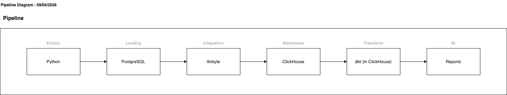

### Collect Flow (BPMN)


### Transform & Load Flow (BPMN)


## Pipeline Scope

The pipeline currently covers the following datasets:

- **Basic Information**
  - Industry
  - Sector
  - Employee Count
  - City
  - Phone
  - State
  - Country
  - Website
  - Address

- **Daily Price**
  - Date
  - Open
  - High
  - Low
  - Close
  - Volume

- **Fundamentals**
  - Assets
  - Debt
  - Invested Capital
  - Share Issued

- **Holders**
  - Date
  - Holder
  - Shares
  - Value

- **Ratings**
  - Date
  - To Grade
  - From Grade
  - Action
  - Firm

- `monthly_stock_summary`
  - average opening price by month
  - average closing price by month
  - average volume by month

## Tech Stack

-  **Python**: extraction logic, utility modules, and DAG code.
-  **Apache Airflow**: orchestration, polling, pre-checks, sync triggering, and dbt execution.
-  **Airbyte OSS**: replication from PostgreSQL landing to ClickHouse staging.
-  **PostgreSQL**: raw landing zone for extracted data and pipeline events.
-  **ClickHouse**: OLAP destination with `staging` and `dwh` databases.
-  **dbt Core + dbt-clickhouse**: transformations, marts, and quality tests.
-  **Docker / Docker Compose**: environment portability and service orchestration.

## Project Structure

```text
.
├── Dockerfile
├── Dockerfile.dbt
├── Makefile
├── VERSION
├── docker-compose.yaml
├── docs/
├── requirements.txt
└── src/
    ├── airflow/
    │   ├── dags/
    │   │   ├── extract/
    │   │   ├── integration/
    │   │   ├── polling/
    │   │   ├── pre-checks/
    │   │   └── transform/
    ├── clickhouse/
    │   ├── config/
    │   └── init/
    ├── config/
    ├── db/
    ├── dbt/
    │   ├── macros/
    │   └── models/
    │       ├── staging/
    │       └── marts/
    └── utils/
```

## Data Model

### Schema

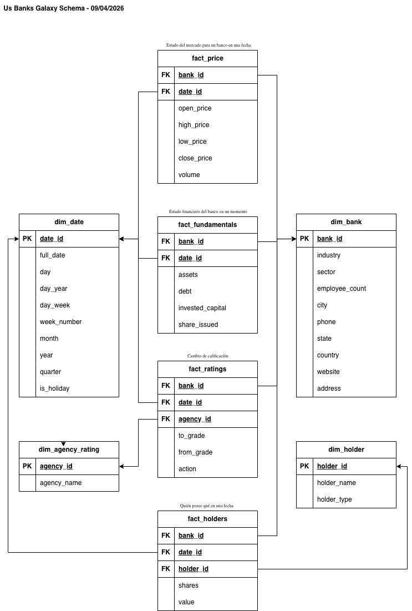

### PostgreSQL Landing Zone

PostgreSQL is used as the initial landing environment for:

- `yfinance_company`
- `yfinance_prices`
- `yfinance_fundamentals`
- `yfinance_holders`
- `yfinance_recommendations`
- `yfinance_run_metadata`
- `yfinance_ingestion_metrics`
- `pipeline_events`

Relevant files:

- `src/db/landing.py`
- `src/db/connection.py`

### ClickHouse

The following databases are initialized in ClickHouse:

- `staging`
- `dwh`

Defined in:

- `src/clickhouse/init/001-create-db.sql`

### dbt Layers

#### Staging

dbt staging models are materialized as **views** in ClickHouse `staging`. They provide:

- cleaned field names
- type casting
- filtering of Airbyte rows marked with ingestion errors

#### Marts

dbt mart models are materialized in ClickHouse `dwh`. Current models include:

- `dim_bank`
- `dim_date`
- `dim_holder`
- `dim_agency_rating`
- `fact_price`
- `fact_fundamentals`
- `fact_holders`
- `fact_ratings`
- `monthly_stock_summary`

## Quality Controls

The project includes multiple quality and reliability mechanisms:

- **Pre-check DAGs**
  - Yahoo Finance connectivity
  - PostgreSQL landing connectivity
  - ClickHouse connectivity
  - Airbyte API and Airflow Airbyte connection
  - dbt image and staging availability

- **Incremental extraction behavior**
  - polling and date-based filtering prevent full reloads when not necessary

- **Event logging**
  - pipeline events are persisted into PostgreSQL landing
  - failure and sync events are emitted for observability

- **Anomaly support**
  - ingestion metrics and volume anomaly detection are included in the extraction flow

- **dbt tests**
  - `not_null`
  - `unique`
  - `relationships`

Relevant files:

- `src/utils/events.py`
- `src/dbt/models/staging/schema.yml`
- `src/dbt/models/marts/schema.yml`

## Automated Flow

The automated orchestration is divided into the following DAG categories:

### Extraction

- `src/airflow/dags/extract/yfinance_extract_dag.py`

Responsibilities:

- run Yahoo Finance extraction
- validate source availability
- persist raw and semi-structured bank data into PostgreSQL landing
- persist metrics and pipeline events

### Polling

- `src/airflow/dags/polling/yfinance_polling_dag.py`
- `src/airflow/dags/polling/landing_zone_polling_dag.py`

Responsibilities:

- detect new market data before extraction
- detect new landing runs before synchronization

### Integration

- `src/airflow/dags/integration/landing_to_clickhouse_sync_dag.py`

Responsibilities:

- trigger Airbyte sync from PostgreSQL to ClickHouse
- update landing synchronization watermark
- trigger dbt after a successful sync

### Transformation

- `src/airflow/dags/transform/dbt_run_dag.py`

Responsibilities:

- run `dbt run`
- run `dbt test`
- emit transformation completion/failure events

## Installation

### Prerequisites

- Docker
- `abctl` for local Airbyte OSS

Airbyte OSS quickstart:

- <https://docs.airbyte.com/platform/using-airbyte/getting-started/oss-quickstart>

### Clone the Repository

```bash
git clone https://github.com/vladimircuriel/sb-data-engineering-pipeline.git
cd sb-data-engineering-pipeline
```

## Configuration

Create a local environment file from the example:

```bash
cp .env.example .env
```

Minimum values to review before running:

- `FERNET_KEY`
- `AIRFLOW_UID`
- `LANDING_DB_CONN`
- `CLICKHOUSE_HOST`
- `CLICKHOUSE_HTTP_PORT`
- `CLICKHOUSE_USER`
- `CLICKHOUSE_PASSWORD`
- `CLICKHOUSE_DB`
- `AIRFLOW_CONN_AIRBYTE_DEFAULT`
- `HOST_PROJ_DIR`
- `COMPOSE_PROJECT_NAME`

If using the provided `Makefile`, Airbyte credentials are extracted automatically after `abctl local install` and appended to `.env`.

As this is a local development environment with no sensitive data, credentials are stored in `.env` for simplicity in this repository.

## Execution Guide

### 1. Start Airbyte, build dbt, and start the local stack

```bash
make up
```

This performs:

- Airbyte local installation via `abctl`
- credential extraction into `.env`
- dbt image build
- Docker Compose startup for Airflow, PostgreSQL, Redis, ClickHouse, and dbt runtime support

### 2. Confirm running services

Recommended checks:

- Airflow UI: `http://localhost:8080`
- ClickHouse HTTP: `http://localhost:8123`
- Tabix UI: `http://localhost:8124`
- PostgreSQL landing: `localhost:5433`
- Airbyte UI: as exposed by `abctl` local environment

### 3. Configure Airbyte connection

Inside the Airbyte UI, create:

- **Source**: PostgreSQL landing database
- **Destination**: ClickHouse
- **Connection**: PostgreSQL landing -> ClickHouse staging

After creating the connection:

- copy the Airbyte connection UUID
- set it in `.env` as `AIRFLOW_VAR_AIRBYTE_LANDING_TO_CLICKHOUSE_CONNECTION_ID`

### 4. Trigger extraction

In Airflow, run:

- `yfinance_polling_dag`

This loads the PostgreSQL landing zone.

### 5. Trigger synchronization

In Airflow, run:

- `landing_to_clickhouse_sync_dag`

This executes:

- Airbyte pre-check
- PostgreSQL pre-check
- ClickHouse pre-check
- Airbyte sync
- dbt run
- dbt test

### 6. Polling-based automation

It can rely on:

- `yfinance_polling_dag`
- `landing_zone_polling_dag`

to trigger extraction and synchronization when new data is detected.

## Screenshots and Evidence

### Docker

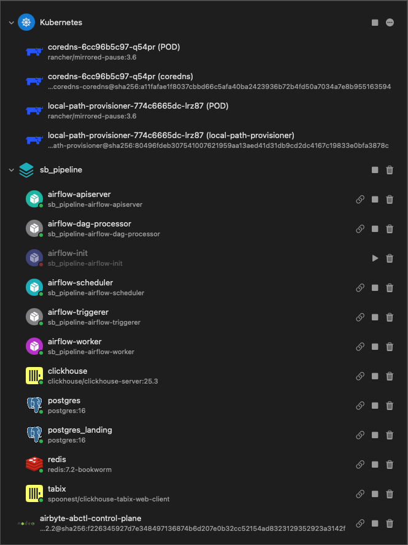

### Airflow — DAG List

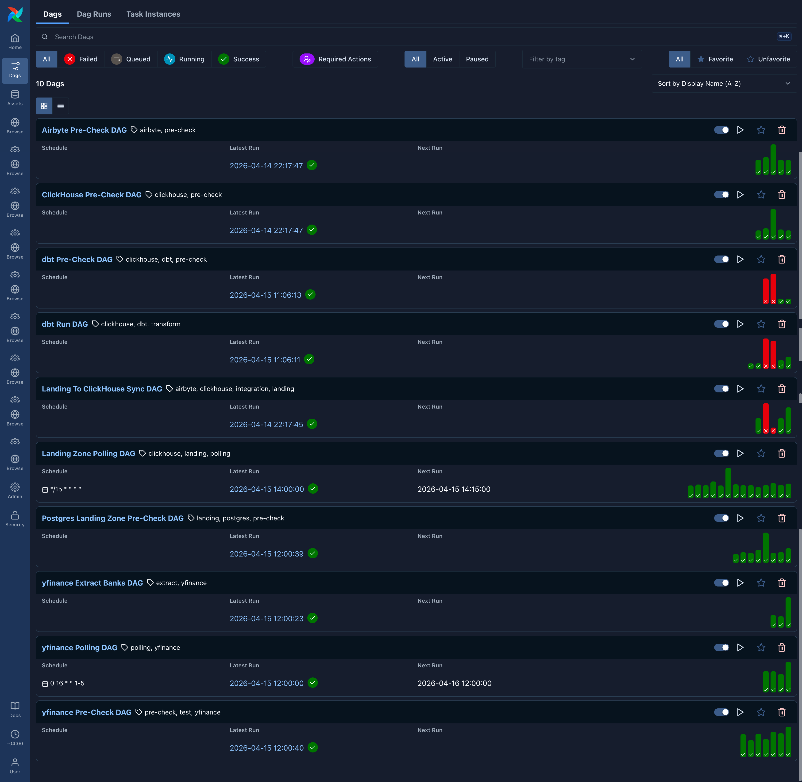

### Airflow — Extract Run

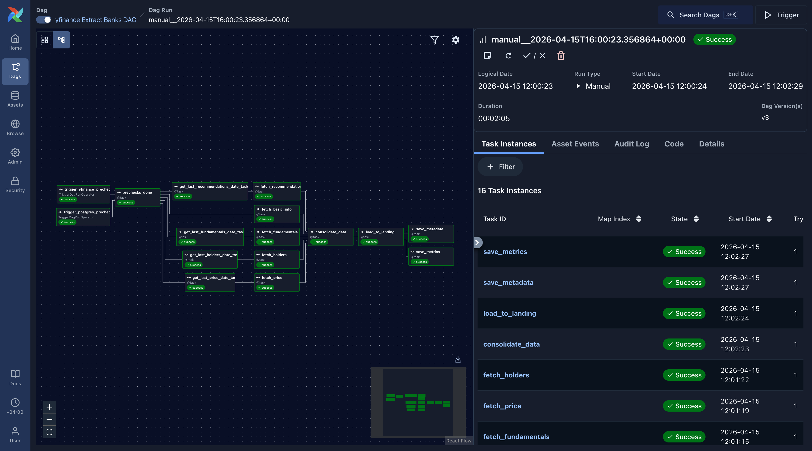

### Airflow — dbt Run

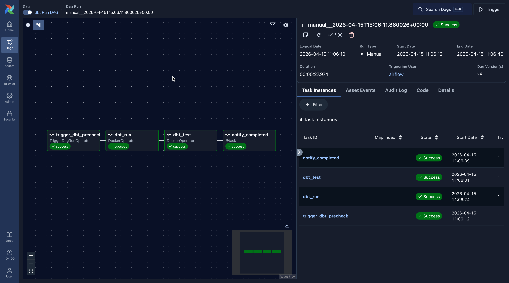

### Airbyte — Connection Setup

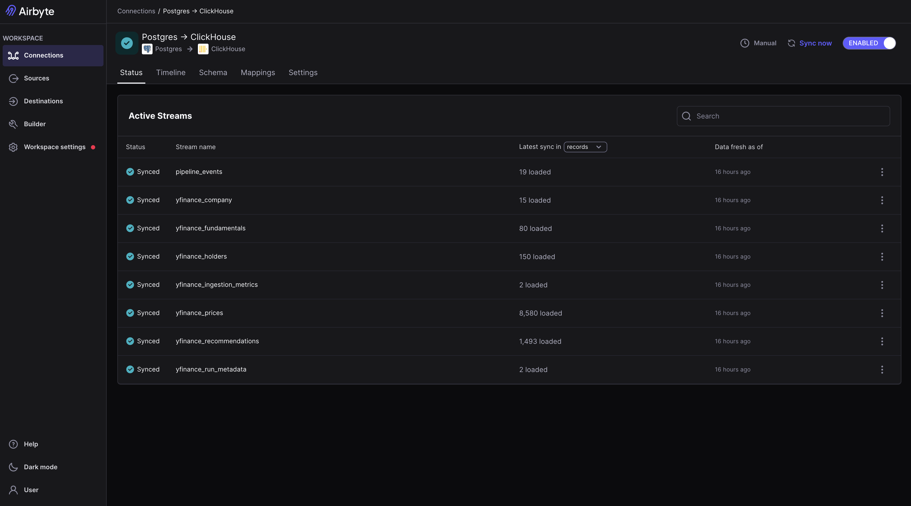

### Airbyte — Sync Success

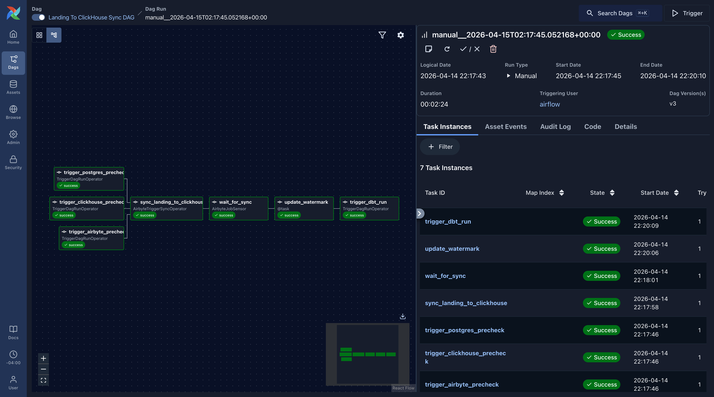

### ClickHouse — Staging Tables

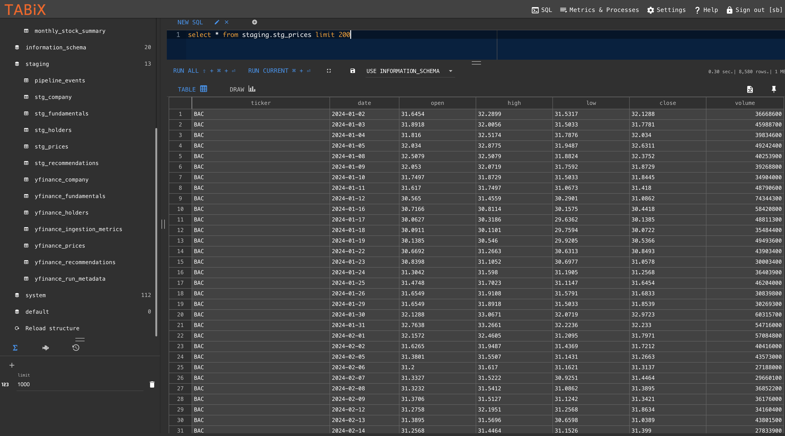

### ClickHouse — DWH Tables

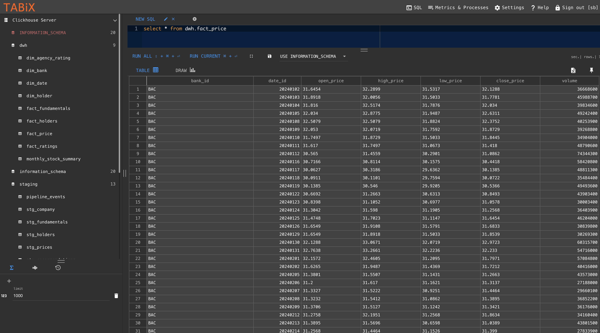

### ClickHouse — Monthly Stock Summary

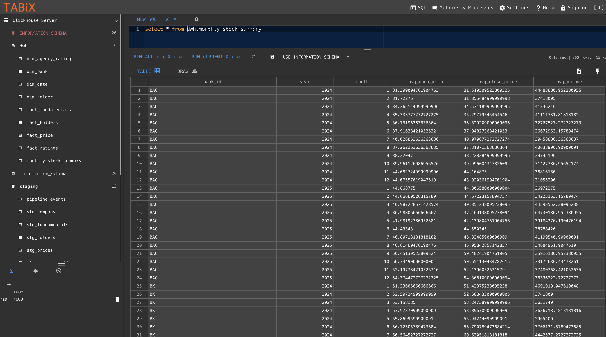

### PostgreSQL — Landing Zone

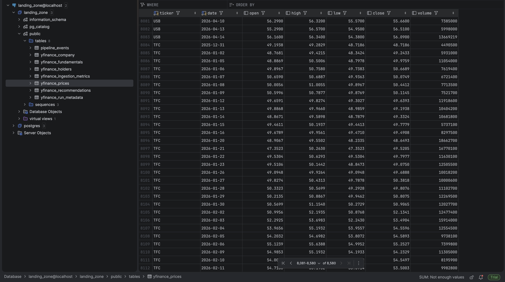

### Demo

<a href="https://www.youtube.com/watch?v=Z6hAF-3kU1A" target="_blank"
style="
display:inline-block;
background-color:#FF0000;
color:white;
padding:12px 20px;
text-decoration:none;
font-weight:bold;
border-radius:6px;
font-family:Arial, sans-serif;
font-size:14px;
box-shadow:0 2px 4px rgba(0,0,0,0.2);
">
▶ Ver en YouTube
</a>


## Known Limitations

- Airbyte connection setup is not fully declarative yet and still requires manual UI configuration. This tradeoff was accepted because the project uses `abctl` as the official local installation path for Airbyte OSS, while Airbyte has documented the transition away from the previous Docker Compose-based deployment approach in favor of `abctl` and Kubernetes-based local installs. References:
  - Airbyte OSS quickstart with `abctl`: <https://docs.airbyte.com/platform/using-airbyte/getting-started/oss-quickstart>
  - Airbyte official migration note on `abctl` replacing Docker Compose: <https://airbyte.com/blog/understand-and-troubleshoot-your-migration-to-abctl>

## Areas for Improvement

- **Centralized Secret Management**: In more sensitive environments, credentials should not live in a local `.env` file. They could be centralized in a secret manager such as AWS Secrets Manager, HashiCorp Vault, Doppler, or Kubernetes Secrets, and then injected into Airflow, dbt, and Docker services at runtime.

- **Operational Alerting**: Pipeline events are already persisted and emitted internally, but in a more production-sensitive setting they should also trigger external notifications such as email alerts, Slack notifications, or incident channels whenever extraction, sync, validation, or transformation failures occur.

## References

The following references were used to support framework selection, local environment setup, connector integration, and transformation design decisions.

### Core Implementation References

- **Airflow Docker deployment**
  - <https://airflow.apache.org/docs/apache-airflow/3.2.0/docker-compose.yaml>

- **Airbyte OSS local quickstart**
  - <https://docs.airbyte.com/platform/using-airbyte/getting-started/oss-quickstart>
  - `abctl local install`
  - <https://github.com/airbytehq/airbyte/discussions/45847>

- **Yahoo Finance extraction**
  - <https://pypi.org/project/yfinance/>
  - <https://github.com/ranaroussi/yfinance>
  - <https://ranaroussi.github.io/yfinance/>

- **dbt with ClickHouse**
  - <https://clickhouse.com/docs/integrations/dbt>

- **Airbyte to ClickHouse integration**
  - <https://docs.airbyte.com/integrations/destinations/clickhouse>
  - <https://clickhouse.com/docs/integrations/airbyte>
  - <https://airbyte.com/how-to-sync/postgresql-to-clickhouse-warehouse>

- **ClickHouse Docker and storage engine design**
  - <https://clickhouse.com/docs/install/docker>
  - <https://github.com/ClickHouse/ClickHouse/blob/master/docker/server/README.md>
  - <https://clickhouse.com/docs/engines/table-engines/mergetree-family/mergetree>
  - <https://clickhouse.com/docs/engines/table-engines/mergetree-family/replacingmergetree>
  - <https://clickhouse.com/docs/sql-reference/data-types>
  - <https://clickhouse.com/docs/sql-reference/data-types/lowcardinality>

- **PostgreSQL landing design**
  - <https://www.dbvis.com/thetable/json-vs-jsonb-in-postgresql-a-complete-comparison/>

#### Complementary References

- **Airbyte / Yahoo Finance examples**
  - <https://airbyte.com/pyairbyte/yahoo-finance-price-python>

- **Background reading on Yahoo Finance API usage**
  - <https://algotrading101.com/learn/yahoo-finance-api-guide/>

